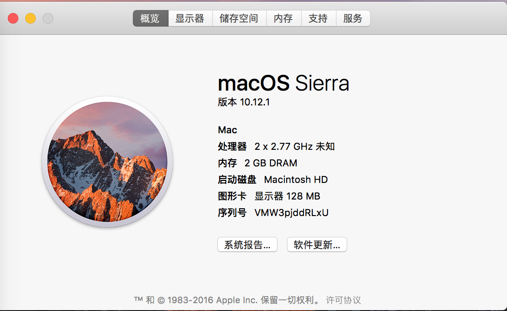
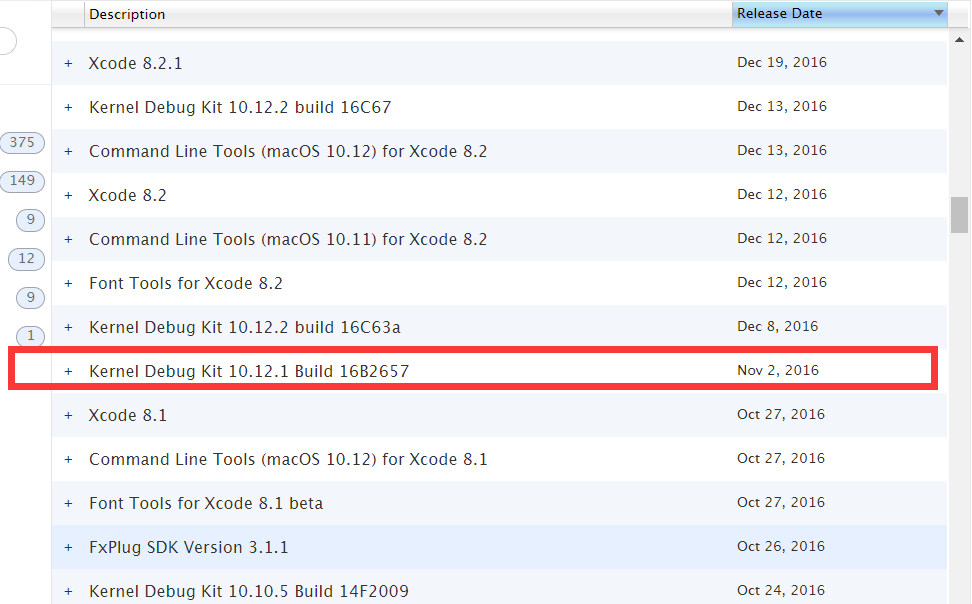
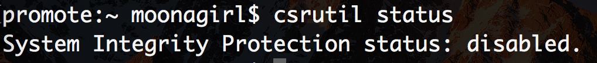
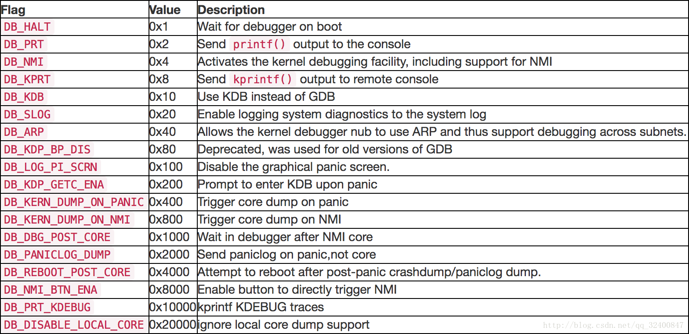
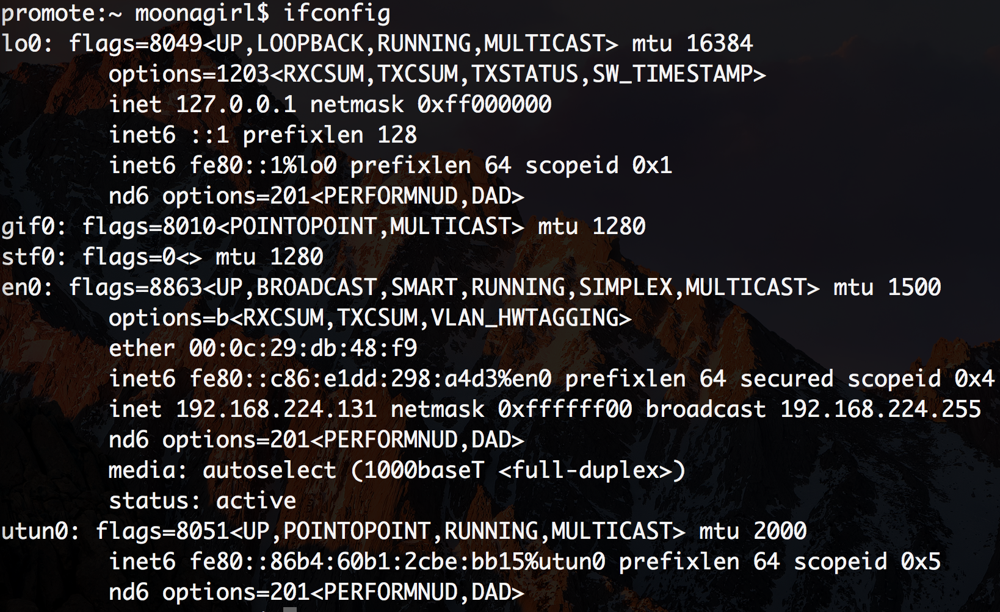
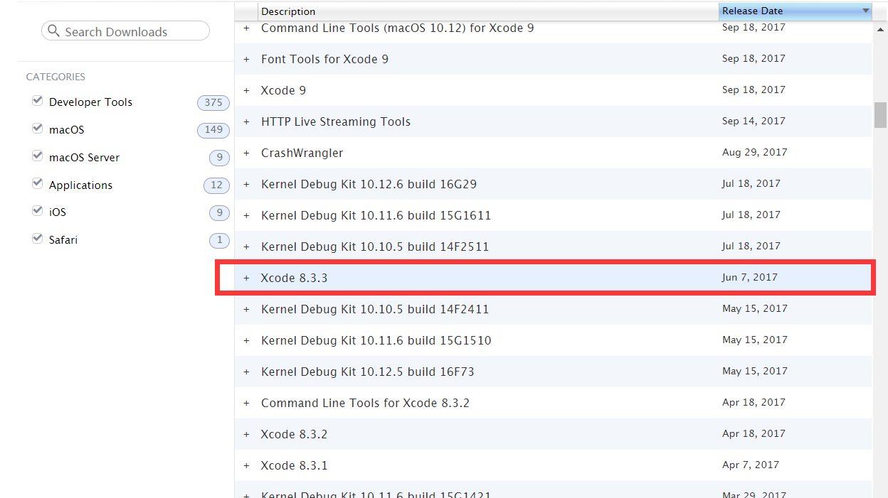
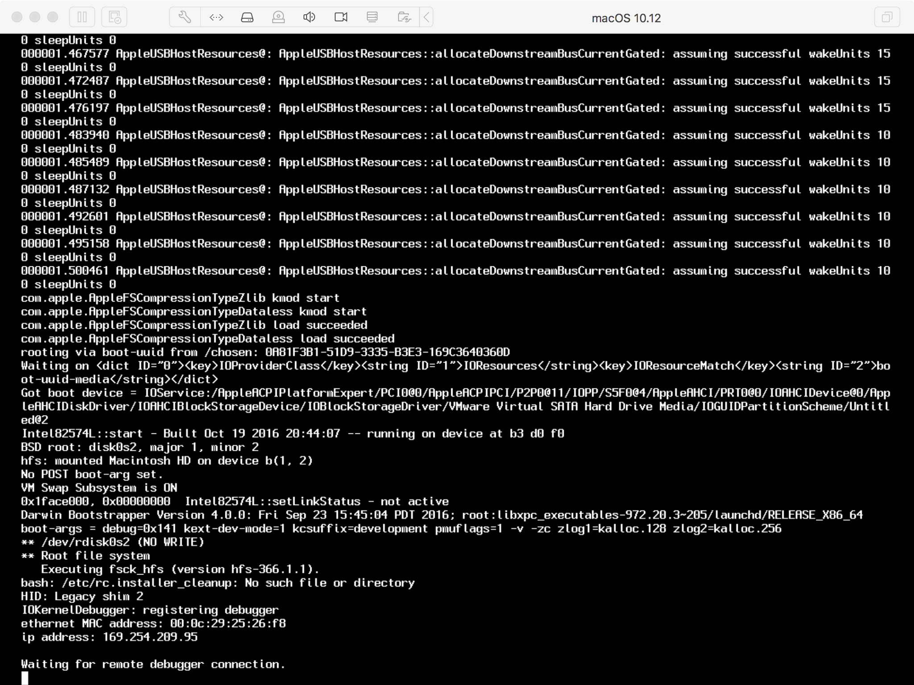
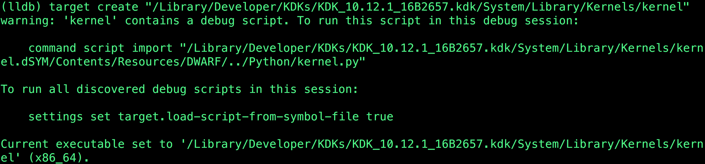
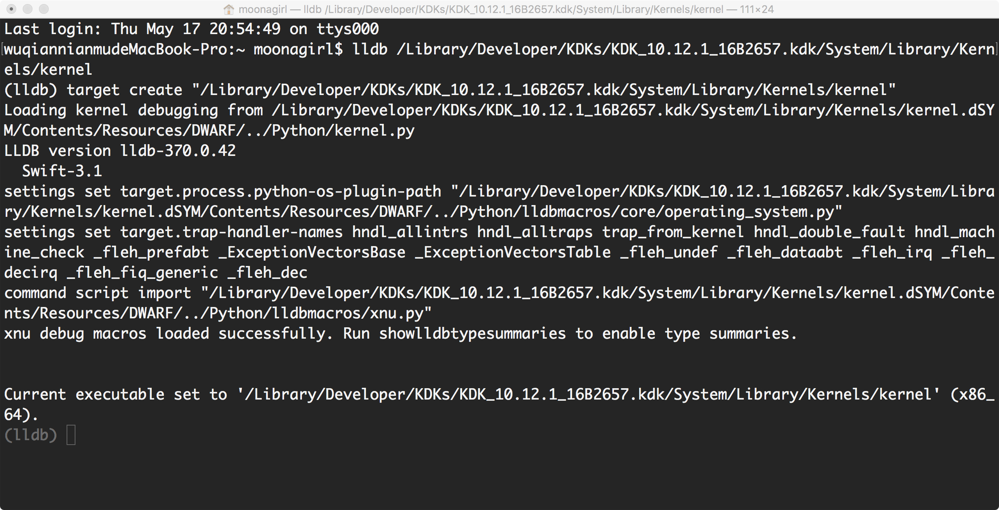
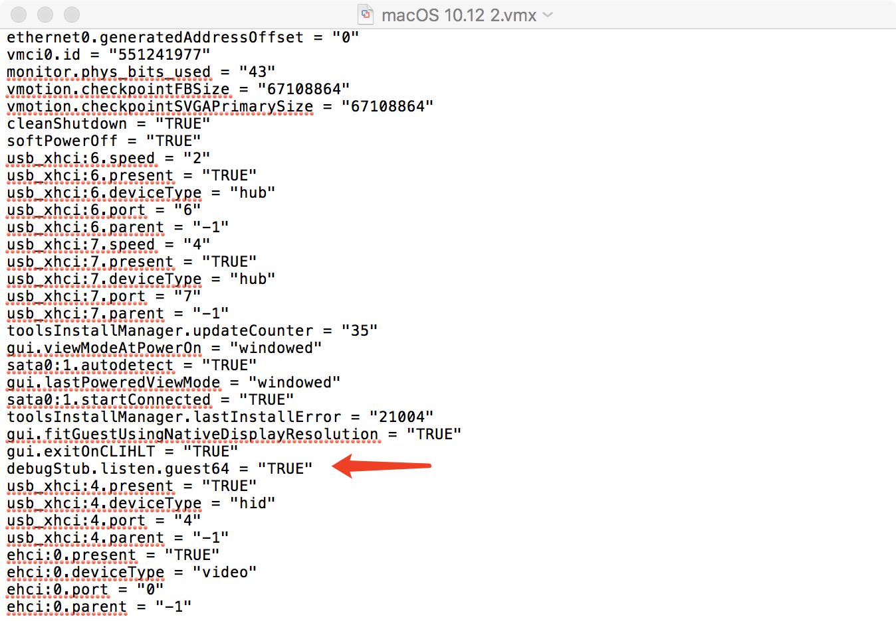

> http://ddeville.me/2015/08/using-the-vmware-fusion-gdb-stub-for-kernel-debugging-with-lldb
> http://ddeville.me/2015/08/kernel-debugging-with-lldb-and-vmware-fusion
> https://blog.csdn.net/qq_32400847/article/details/79297177
> https://media.defcon.org/DEF%20CON%2025/DEF%20CON%2025%20presentations/DEFCON-25-Min-Spark-Zheng-macOS-iOS-Kernel-Debugging.pdf
> https://theori.io/research/korean/osx-kernel-exploit-1

# MacOS内核调试环境搭建
## 方法一：LLDB+VMware Fusion+KDK
### 准备工作
#### 1.在Mac中安装好LLDB(安装适合自己mac版本的xcode即可,xcode中自带lldb)，下载地址：https://developer.apple.com/download/more/

#### 2.在Mac中安装好VMware Fusion，

#### 3.准备好一个macos镜像

#### 4.下载对应版本内核调试工具包(KDK,下载地址；https://developer.apple.com/download/more/

### 对于虚拟机中的操作

#### 1.安装MacOS虚拟机

#### 2.安装对应版本内核调试工具包(KDK)

#### 3.关闭SIP

关闭虚拟机的SIP，开机的时候按Command+R进入恢复模式，然后在终端输入csrutil disable。重启之后可以用csrutil status命令查看是否成功关闭。 

#### 4.内核替换

将位于KDK安装目录下的可执行文件kernel.development复制到/System/Library/Kernels

    cp /Library/Developer/KDKs/KDK_10.12.1_16B2657.kdk/System/Library/Kernels/kernel.development /System/Library/Kernels

#### 5.设置boot-args

为了将虚拟机设置成调试模式，需要使用nvram设置boot-args，命令如下

	sudo nvram boot-args="debug=0x141 kext-dev-mode=1 kcsuffix=development pmuflags=1 -v"

debug=0x141含义如下图所示

kext-dev-mode=1允许加载未签名kext，kcsuffix=development指定加载上面拷贝的kernel.development，pmuflags=1关闭定时器，-v显示内核加载信息

#### 6.清除kext缓存

	sudo kextcache -invalidate /

让虚拟机系统的kext cache无效，使用新的内核调试

#### 7.下载内核代码

运行uname -v命令查看xnu源码版本，并从苹果开源代码上下载，下载地址：https://opensource.apple.com/tarballs/xnu/

#### 8.查看虚拟机网络配置信息

为了将调试器连接到虚拟机，我们需要一些关于其网络配置的信息

### 对于主机中的操作

#### 1.安装Xcode

Xcode中自带了lldb,选择适合自己mac版本的xcode版本进行安装，我这里选择8.3.3

#### 2.安装内核调试工具包

安装与虚拟机中相同版本的内核调试工具包

#### 3.关闭SIP

### 开始调试

#### 1.重启虚拟机

虚拟机会等待调试器链接

#### 2.启动LLDB并将目标设置为位于KDK中的(本地)内核二进制文件

$lldb
(lldb)target create /Library/Developer/KDKs/KDK_10.12.1_16B2657.kdk/System/Library/Kernels/kernel.development

如果遇到以下问题

就执行以下命令

	(lldb) command script import "/Library/Developer/KDKs/KDK_10.12.1_16B2657.kdk/System/Library/Kernels/kernel.dSYM/Contents/Resources/DWARF/../Python/kernel.py"
	
	$ echo "settings set target.load-script-from-symbol-file true" > ~/.lldbinit

再重新启动LLDB并将目标设置为位于KDK中的(本地)内核二进制文件

#### 3.连接虚拟机

执行命令 

	kdp-remote 虚拟机IP地址

就可以开始调试

### 存在的问题

	一旦内核启动并且调试器继续运行，内核就不能再从调试器中停止。

#### 1.改进

在虚拟机中执行

	$sudo nvram boot-args="debug=0x144 kext-dev-mode=1 kcsuffix=development pmuflags=1 -v"

之后如果想再运行时断下，就在虚拟机中按组合键

	Command-Option-Control-Shift-Escape		

就可以了

## 方法二：VMware Fusion GDB stub + LLDB

### 修改虚拟机配置文件

每个虚拟机文件都包含一个可以编辑的.vmx配置文件.vmwarevm（确保虚拟机在编辑时没有运行）

在文本编辑器中打开它并添加以下行：

	# If you are debugging a 32-bit machine use `guest32`
	debugStub.listen.guest64 = "TRUE"

### 用gdb进行调试

mac中gdb需要自己安装，请大家自行解决

启动虚拟机，在gdb中附加虚拟机进行调试

	(gdb) file /Library/Developer/KDKs/KDK_10.10.5_14F27.kdk/System/Library/Kernels/kernel.development
	Reading symbols from /Library/Developer/KDKs/KDK_10.10.5_14F27.kdk/System/Library/Kernels/kernel.development...Reading symbols from /Library/Developer/KDKs/KDK_10.10.5_14F27.kdk/System/Library/Kernels/kernel.development.dSYM/Contents/Resources/DWARF/kernel.development...
	done.
	(gdb) target remote localhost:8864
	Remote debugging using localhost:8864
	0xffffff800f9f1e52 in ?? ()

### 用lldb进行调试

LLDB实际上支持使用gdb-remote命令连接到GDB远程机器

	(lldb) file /Library/Developer/KDKs/KDK_10.10.5_14F27.kdk/System/Library/Kernels/kernel.development
	Current executable set to '/Library/Developer/KDKs/KDK_10.10.5_14F27.kdk/System/Library/Kernels/kernel.development' (x86_64).
	(lldb) gdb-remote 8864
	Kernel UUID: C75BDFDD-9F27-3694-BB80-73CF991C13D8
	Load Address: 0xffffff800f800000
	Kernel slid 0xf600000 in memory.
	Loaded kernel file /Library/Developer/KDKs/KDK_10.10.5_14F27.kdk/System/Library/Kernels/kernel.development
	Loading 87 kext modules ....................................................................................... done.
	Target arch: x86_64
	Connected to live debugserver or arm core. Will associate on-core threads to registers reported by server.
	Process 1 stopped
	* thread #3: tid = 0x0066, name = '0xffffff801c91d9c0', queue = 'cpu-0', stop reason = signal SIGTRAP
	    frame #0: 0xffffffffffffffff

### 实时断点

只需要Ctrl + C即可及时在调试器中断下

