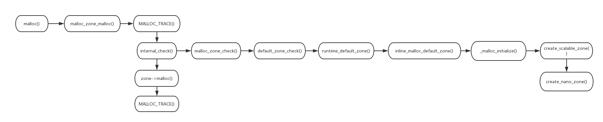

 ## 0.start

 mac中的堆块以zone为单位，类似于linux中的chunk
 以下是一次完整的malloc的流程图

 ## 1.malloc
 从malloc开始

    /* /libmalloc/libmalloc-140.40.1/src/malloc.c */
    void *
    malloc(size_t size)
    {
        void *retval;
        retval = malloc_zone_malloc(default_zone, size);
        if (retval == NULL) {
            errno = ENOMEM;
        }
        return retval;
    }

### default_zone

在malloc内部是调用了malloc_zone_malloc函数,并向malloc_zone_malloc函数传入了两个参数，一个是一个全局变量default_zone和一个用户要申请的size

在看malloc_zone_malloc函数前先看一下default_zone是什么，它初始化为virtual_default_zone.malloc_zone

    /* /libmalloc/libmalloc-140.40.1/src/malloc.c */
    static malloc_zone_t *default_zone = &virtual_default_zone.malloc_zone;

virtual_default_zone的结构如下

    /* /libmalloc/libmalloc-140.40.1/src/malloc.c */
    virtual_default_zone
    typedef struct {
        malloc_zone_t malloc_zone;
        uint8_t pad[PAGE_MAX_SIZE - sizeof(malloc_zone_t)];
    } virtual_default_zone_t;

    static virtual_default_zone_t virtual_default_zone

可以看到malloc_zone的结构体为malloc_zone_t，继续看一下malloc_zone_t结构体的结构

    //
    typedef struct _malloc_zone_t {
        /* Only zone implementors should depend on the layout of this structure;
        Regular callers should use the access functions below */
        void	*reserved1;	/* RESERVED FOR CFAllocator DO NOT USE */
        void	*reserved2;	/* RESERVED FOR CFAllocator DO NOT USE */
        size_t 	(*size)(struct _malloc_zone_t *zone, const void *ptr); /* returns the size of a block or 0 if not in this zone; must be fast, especially for negative answers */
        void 	*(*malloc)(struct _malloc_zone_t *zone, size_t size);
        void 	*(*calloc)(struct _malloc_zone_t *zone, size_t num_items, size_t size); /* same as malloc, but block returned is set to zero */
        void 	*(*valloc)(struct _malloc_zone_t *zone, size_t size); /* same as malloc, but block returned is set to zero and is guaranteed to be page aligned */
        void 	(*free)(struct _malloc_zone_t *zone, void *ptr);
        void 	*(*realloc)(struct _malloc_zone_t *zone, void *ptr, size_t size);
        void 	(*destroy)(struct _malloc_zone_t *zone); /* zone is destroyed and all memory reclaimed */
        const char	*zone_name;

        /* Optional batch callbacks; these may be NULL */
        unsigned	(*batch_malloc)(struct _malloc_zone_t *zone, size_t size, void **results, unsigned num_requested); /* given a size, returns pointers capable of holding that size; returns the number of pointers allocated (maybe 0 or less than num_requested) */
        void	(*batch_free)(struct _malloc_zone_t *zone, void **to_be_freed, unsigned num_to_be_freed); /* frees all the pointers in to_be_freed; note that to_be_freed may be overwritten during the process */

        struct malloc_introspection_t	*introspect;
        unsigned	version;
            
        /* aligned memory allocation. The callback may be NULL. Present in version >= 5. */
        void *(*memalign)(struct _malloc_zone_t *zone, size_t alignment, size_t size);
        
        /* free a pointer known to be in zone and known to have the given size. The callback may be NULL. Present in version >= 6.*/
        void (*free_definite_size)(struct _malloc_zone_t *zone, void *ptr, size_t size);

        /* Empty out caches in the face of memory pressure. The callback may be NULL. Present in version >= 8. */
        size_t 	(*pressure_relief)(struct _malloc_zone_t *zone, size_t goal);
    } malloc_zone_t;

可以看到malloc_zone_t中主要保存了一系列操作函数指针

回到malloc_zone_malloc函数，传入的参数为函数接口和用户申请的size

## 2.malloc_zone_malloc

接着进入malloc_zone_malloc函数内部

    /* /libmalloc/libmalloc-140.40.1/src/malloc.c */
    void *
    malloc_zone_malloc(malloc_zone_t *zone, size_t size)
    {
        MALLOC_TRACE(TRACE_malloc | DBG_FUNC_START, (uintptr_t)zone, size, 0, 0);

        void *ptr;
        if (malloc_check_start && (malloc_check_counter++ >= malloc_check_start)) {
            internal_check();
        }
        if (size > MALLOC_ABSOLUTE_MAX_SIZE) {
            return NULL;
        }

        ptr = zone->malloc(zone, size);		// if lite zone is passed in then we still call the lite methods

        
        if (malloc_logger) {
            malloc_logger(MALLOC_LOG_TYPE_ALLOCATE | MALLOC_LOG_TYPE_HAS_ZONE, (uintptr_t)zone, (uintptr_t)size, 0, (uintptr_t)ptr, 0);
        }

        MALLOC_TRACE(TRACE_malloc | DBG_FUNC_END, (uintptr_t)zone, size, (uintptr_t)ptr, 0);
        return ptr;
    }

一句一句分析

### MALLOC_TRACE
先看

    /* /libmalloc/libmalloc-140.40.1/src/malloc.c */
    MALLOC_TRACE(TRACE_malloc | DBG_FUNC_START, (uintptr_t)zone, size, 0, 0);

MALLOC_TRAC的定义如下

    /* /libmalloc/libmalloc-140.40.1/src/trace.h */
    #define MALLOC_TRACE(code,arg1,arg2,arg3,arg4) \
	{ if (malloc_tracing_enabled) { kdebug_trace(code, arg1, arg2, arg3, arg4); } }

它是一个宏定义，继续分析,默认malloc_tracing_enabled为false

    /* /libmalloc/libmalloc-140.40.1/src/malloc.c */
    boolean_t malloc_tracing_enabled = false;

所以这里暂时没有产生作用

### malloc_check_star

    /* /libmalloc/libmalloc-140.40.1/src/malloc.c */
    if (malloc_check_start && (malloc_check_counter++ >= malloc_check_start)) {
                internal_check();
            }

malloc_check_star和malloc_check_counter的定义

    /* /libmalloc/libmalloc-140.40.1/src/malloc.c */
    unsigned malloc_check_start = 0; // 0 means don't check
    unsigned malloc_check_counter = 0;

internal_check()函数定义

    static void
    internal_check(void)
    {
        static vm_address_t *frames = NULL;
        static unsigned num_frames;
        if (malloc_zone_check(NULL)) {
            if (!frames) {
                vm_allocate(mach_task_self(), (void *)&frames, vm_page_size, 1);
            }
    ......

malloc_zone_check函数定义

    boolean_t
    malloc_zone_check(malloc_zone_t *zone)
    {
        boolean_t ok = 1;
        if (!zone) {
            unsigned index = 0;
            while (index < malloc_num_zones) {
                zone = malloc_zones[index++];
                if (!zone->introspect->check(zone)) {
                    ok = 0;
                }
            }
        } else {
            ok = zone->introspect->check(zone);
        }
        return ok;
    }

zone->introspect->check(zone)
在前边说过zone结构体，introspect是zone结构体中的成员

    static struct malloc_introspection_t default_zone_introspect = {
        default_zone_ptr_in_use_enumerator,
        default_zone_good_size,
        default_zone_check,
        default_zone_print,
        default_zone_log,
        default_zone_force_lock,
        default_zone_force_unlock,
        default_zone_statistics,
        default_zone_locked,
        NULL,
        NULL,
        NULL,
        NULL,
        default_zone_reinit_lock
    };

其中default_zone_check函数

    static boolean_t
    default_zone_check(malloc_zone_t *zone)
    {
        zone = runtime_default_zone();
        
        return zone->introspect->check(zone);
    }

接着看runtime_default_zone函数

    static inline malloc_zone_t *
    runtime_default_zone() {
        return (lite_zone) ? lite_zone : inline_malloc_default_zone();
    }

继续看inline_malloc_default_zone()函数

    static inline void
    _malloc_initialize_once(void)
    {
        os_once(&_malloc_initialize_pred, NULL, _malloc_initialize);
    }

    static inline malloc_zone_t *
    inline_malloc_default_zone(void)
    {
        _malloc_initialize_once();
        // _malloc_printf(ASL_LEVEL_INFO, "In inline_malloc_default_zone with %d %d\n", malloc_num_zones, malloc_has_debug_zone);
        return malloc_zones[0];
    }

## _malloc_initialize

这里最终调用_malloc_initialize函数初始化zone结构体中的函数指针以及变量

    / To be used in _malloc_initialize_once() only, call that function instead.
    static void
    _malloc_initialize(void *context __unused)
    {
        MALLOC_LOCK();
        unsigned n;
        malloc_zone_t *zone;

        if (!_malloc_entropy_initialized) {
            // Lazy initialization may occur before __malloc_init (rdar://27075409)
            // TODO: make this a fatal error
            malloc_printf("*** malloc was initialized without entropy\n");
        }

        set_flags_from_environment(); // will only set flags up to two times
        n = malloc_num_zones;

    #if CONFIG_NANOZONE //可以通过设置这个全局变量决定是否使用nano_zone
        malloc_zone_t *helper_zone = create_scalable_zone(0, malloc_debug_flags);
        zone = create_nano_zone(0, helper_zone, malloc_debug_flags);

        if (zone) {
            malloc_zone_register_while_locked(zone);
            malloc_zone_register_while_locked(helper_zone);

            // Must call malloc_set_zone_name() *after* helper and nano are hooked together.
            malloc_set_zone_name(zone, DEFAULT_MALLOC_ZONE_STRING);
            malloc_set_zone_name(helper_zone, MALLOC_HELPER_ZONE_STRING);
        } else {
            zone = helper_zone;
            malloc_zone_register_while_locked(zone);
            malloc_set_zone_name(zone, DEFAULT_MALLOC_ZONE_STRING);
        }
    #else
        zone = create_scalable_zone(0, malloc_debug_flags);
        malloc_zone_register_while_locked(zone);
        malloc_set_zone_name(zone, DEFAULT_MALLOC_ZONE_STRING);
    #endif

        initial_default_zone = zone;

        if (n != 0) { // make the default first, for efficiency
            unsigned protect_size = malloc_num_zones_allocated * sizeof(malloc_zone_t *);
            malloc_zone_t *hold = malloc_zones[0];

            if (hold->zone_name && strcmp(hold->zone_name, DEFAULT_MALLOC_ZONE_STRING) == 0) {
                malloc_set_zone_name(hold, NULL);
            }

            mprotect(malloc_zones, protect_size, PROT_READ | PROT_WRITE);
            malloc_zones[0] = malloc_zones[n];
            malloc_zones[n] = hold;
            mprotect(malloc_zones, protect_size, PROT_READ);
        }

        // Only setup stack logging hooks once lazy initialization is complete, the
        // malloc_zone calls above would otherwise initialize malloc stack logging,
        // which calls into malloc re-entrantly from Libc upcalls and so deadlocks
        // in the lazy initialization os_once(). rdar://13046853
        if (stack_logging_enable_logging) {
            switch (stack_logging_mode) {
            case stack_logging_mode_malloc:
                malloc_logger = __disk_stack_logging_log_stack;
                break;
            case stack_logging_mode_vm:
                __syscall_logger = __disk_stack_logging_log_stack;
                break;
            case stack_logging_mode_all:
                malloc_logger = __disk_stack_logging_log_stack;
                __syscall_logger = __disk_stack_logging_log_stack;
                break;
            case stack_logging_mode_lite:
                __syscall_logger = __disk_stack_logging_log_stack;
                create_and_insert_lite_zone_while_locked();
                enable_stack_logging_lite();
                break;
            }
        }

        // _malloc_printf(ASL_LEVEL_INFO, "%d registered zones\n", malloc_num_zones);
        // _malloc_printf(ASL_LEVEL_INFO, "malloc_zones is at %p; malloc_num_zones is at %p\n", (unsigned)&malloc_zones,
        // (unsigned)&malloc_num_zones);
        MALLOC_UNLOCK();
    }

### MALLOC_ABSOLUTE_MAX_SIZE

    /* /libmalloc/libmalloc-140.40.1/src/malloc.c */
    if (size > MALLOC_ABSOLUTE_MAX_SIZE) {
        return NULL;
    }

其中MALLOC_ABSOLUTE_MAX_SIZE的定义如下

    /* /libmalloc/libmalloc-140.40.1/src/malloc.c */
    /*
    * MALLOC_ABSOLUTE_MAX_SIZE - There are many instances of addition to a
    * user-specified size_t, which can cause overflow (and subsequent crashes)
    * for values near SIZE_T_MAX.  Rather than add extra "if" checks everywhere
    * this occurs, it is easier to just set an absolute maximum request size,
    * and immediately return an error if the requested size exceeds this maximum.
    * Of course, values less than this absolute max can fail later if the value
    * is still too large for the available memory.  The largest value added
    * seems to be PAGE_SIZE (in the macro round_page()), so to be safe, we set
    * the maximum to be 2 * PAGE_SIZE less than SIZE_T_MAX.
    */
    #define MALLOC_ABSOLUTE_MAX_SIZE (SIZE_T_MAX - (2 * PAGE_SIZE))

当用户申请的size大于MALLOC_ABSOLUTE_MAX_SIZE时，就返回NULL，申请失败

### zone->malloc

到了这里就调用zone->malloc函数分配内存，前边说过这里zone对应的结构体是个保存大量函数指针的结构体

    ptr = zone->malloc(zone, size);		// if lite zone is passed in then we still call the lite methods

对于nano_zone,根据标志和全局变量的设置不同，对于的分配函数也不同

    nanozone->basic_zone.malloc = (debug_flags & MALLOC_DO_SCRIBBLE) ? (void *)nano_malloc_scribble : (void *)nano_malloc;

nano_malloc_scribble函数

    static void *
    nano_malloc_scribble(nanozone_t *nanozone, size_t size)
    {
        if (size <= NANO_MAX_SIZE) {
            void *ptr = _nano_malloc_check_clear(nanozone, size, 0);
            if (ptr) {
                /*
                * Scribble on allocated memory.
                */
                if (size) {
                    memset(ptr, SCRIBBLE_BYTE, _nano_vet_and_size_of_live(nanozone, ptr));
                }

                return ptr;
            } else {
                /* FALLTHROUGH to helper zone */
            }
        }
        malloc_zone_t *zone = (malloc_zone_t *)(nanozone->helper_zone);
        return zone->malloc(zone, size);
    }

nano_malloc函数

    static void *
    nano_malloc(nanozone_t *nanozone, size_t size)
    {
        if (size <= NANO_MAX_SIZE) {
            void *p = _nano_malloc_check_clear(nanozone, size, 0);
            if (p) {
                return p;
            } else {
                /* FALLTHROUGH to helper zone */
            }
        }

	malloc_zone_t *zone = (malloc_zone_t *)(nanozone->helper_zone);
	return zone->malloc(zone, size);
}

它们的区别暂且不做分析

对于tiny_zone,small_zone,large_zone,调用szone_malloc_should_clear分配内存

    MALLOC_NOINLINE void *
    szone_malloc_should_clear(szone_t *szone, size_t size, boolean_t cleared_requested)
    {
        void *ptr;
        msize_t msize;

        if (size <= SMALL_THRESHOLD) {
            // tiny size: <1024 bytes (64-bit), <512 bytes (32-bit)
            // think tiny
            msize = TINY_MSIZE_FOR_BYTES(size + TINY_QUANTUM - 1);
            if (!msize) {
                msize = 1;
            }
            ptr = tiny_malloc_should_clear(&szone->tiny_rack, msize, cleared_requested);
        } else if (size <= szone->large_threshold) {
            // small size: <15k (<1GB machines), <127k (>1GB machines)
            // think small
            msize = SMALL_MSIZE_FOR_BYTES(size + SMALL_QUANTUM - 1);
            if (!msize) {
                msize = 1;
            }
            ptr = small_malloc_should_clear(&szone->small_rack, msize, cleared_requested);
        } else {
            // large: all other allocations
            size_t num_kernel_pages = round_page_quanta(size) >> vm_page_quanta_shift;
            if (num_kernel_pages == 0) { /* Overflowed */
                ptr = 0;
            } else {
                ptr = large_malloc(szone, num_kernel_pages, 0, cleared_requested);
            }
        }
    #if DEBUG_MALLOC
        if (LOG(szone, ptr)) {
            malloc_printf("szone_malloc returned %p\n", ptr);
        }
    #endif
        /*
        * If requested, scribble on allocated memory.
        */
        if ((szone->debug_flags & MALLOC_DO_SCRIBBLE) && ptr && !cleared_requested && size) {
            memset(ptr, SCRIBBLE_BYTE, szone_size(szone, ptr));
        }

        return ptr;
    }

### malloc_logger

    if (malloc_logger) {
        malloc_logger(MALLOC_LOG_TYPE_ALLOCATE | MALLOC_LOG_TYPE_HAS_ZONE, (uintptr_t)zone, (uintptr_t)size, 0, (uintptr_t)ptr, 0);
    }

malloc_logger对应的结构

    typedef void(malloc_logger_t)(uint32_t type,
            uintptr_t arg1,
            uintptr_t arg2,
            uintptr_t arg3,
            uintptr_t result,
            uint32_t num_hot_frames_to_skip);

    extern malloc_logger_t *__syscall_logger; // use this to set up syscall logging (e.g., vm_allocate, vm_deallocate, mmap, munmap)

走到这里一个完整的malloc就结束了，这里只大概走了一下流程，具体分配机制另开一篇再谈